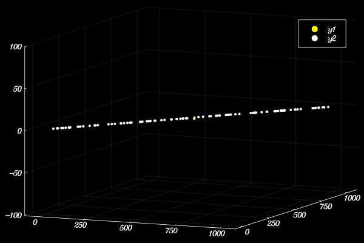

# Barnes Hut Galaxy Simulator

This is a galaxy simulator implemented with Barnes Hut Algorithm.

## Background
Barnes-Hut Algorithm is a novel and clever algorithm in solving the famous n-body problem, which is used to predict the motion of individual objects under the influence of other objects in a cosmological setting. By the usage of tree data structure and grouping nearby bodies, Barnes-Hut Algorithm reduces the time complexity from the brute force O(n^2) to O(nlogn).

Read more: [wikipedia](https://en.wikipedia.org/wiki/Barnes%E2%80%93Hut_simulation)

## Installation


Clone this repository from Github
```      
git clone https://github.com/KeKeJin/Barnes-Hut-Galaxy-Simulator.git
```

## Usage

### Getting Started
To start the simulation, run
```
include("simulation.jl")
```
#### Theta
The key of the algorithm is while calculating the net force on a body, not to iterate through all the other bodies in the system, but to selectively decide whether to approximate a group of bodies or not. This is done by specifying a parameter `theta`. In short, the bigger the `theta`, the more approximating a group of close bodies as one body. If `theta` is set to 0, there is no approximation.

In the simulation, `theta` is set to 0.7. To change it
```
changeTheta(newTheta -> a floating point indication the theta of the algorithm)
```
#### Speeding Up/Slowing Down the Simulation
If you feel like the stars are moving too slow or too fast
```
changeSpeed(factor -> a floating point indicating how much faster/slower)
```
#### Making the Simulation Longer/Shorter
If you want to check how long is the current simulation
```
getDuration()
```
If you want to simulate a longer or a shorter time
```
changeDuration(factor -> a floating point indicating how much longer/shorter)
```
#### Changing Rotation Plane
The rotation plane is set up so that all bodies are assigned an initial swirl on the rotation plane. This is crucial for certain simulations like disk simulation. However, if you want to change the plane where all stars are rotating on,
```
changeRotatingPlane(vector -> a 3-D normal vector of a plane)
```

#### Additional Notes
In the below simulation, the yellow dot marks the center of mass of the system, and the simulator writes CSV files in ```\data``` and erases them later.

---

### A Random Galaxy
The default simulation simulates 100 bodies in a 3D space of 3300pc, while 1 second in the simulation represents 5 million years.  
```
randomGalaxy([, num => number of bodies in the simulator])
```


---

### A Disk-Shaped Galaxy
The default simulation simulates 100 bodies in a disk in the plane x+y=0, while 1 second in the simulation represents 5 million years.
```
diskGalaxy([, normal => normal vector of the disk plane,
            num => number of bodies in the simulator])
```


---

### A Line-Shaped Galaxy
The default simulation simulates 100 bodies in a line of in the direction of (1,1,0), while 1 second in the simulation represents 5 million years.
```
lineGalaxy([, dir => direction vector of the line,
            num => number of bodies in the simulator])
```
The simulator writes CSV files in ```\data``` and erases them later.


---

### A System of Two Galaxies
The default simulation simulates a disk-shaped galaxy of 100 bodies in the plane of x+y=0 moving towards a disk-shaped galaxy of 100 bodies in the plane of x+y+z=0
```
twoCollapseGalaxy([,num1 -> number of bodies in the first galaxy,
                  num2 -> number of bodies in the second galaxy,
                  velocity1 -> the velocity of the first galaxy,
                  velocity2 -> the velocity of the second galaxy,
                  type1 -> the type of the first galaxy,
                  type2 -> the type of the second galaxy,
                  vector1 -> the normal vector or direction vector of the first galaxy,
                  vector2 -> the normal vector or direction vector of the second galaxy]
```


---

## Todos
1. Two Galaxies collapsing needs the user to define a better initial condition than the default
2. Line-shaped galaxy simulator needs to tune the parameter `strengthOfInteraction`
3. Employ a better initial mass function
4. Add progress bar while the program is running
5. Add interactive interface to view the simulation from different angles
6. More robust tuning of parameters `strengthOfInteraction`and `timeScalar` with different input
7. Parallelize and optimize the code

## Credits
Thanks to Professor Vatche Sahakian for inspiring this project, providing feedbacks, and helping to trouble shoot.

Thanks to my friend Jonathan Hayase for julia syntax support and providing feedbacks and idea.

And thanks to my only and truly almighty God for the amazing universe.
